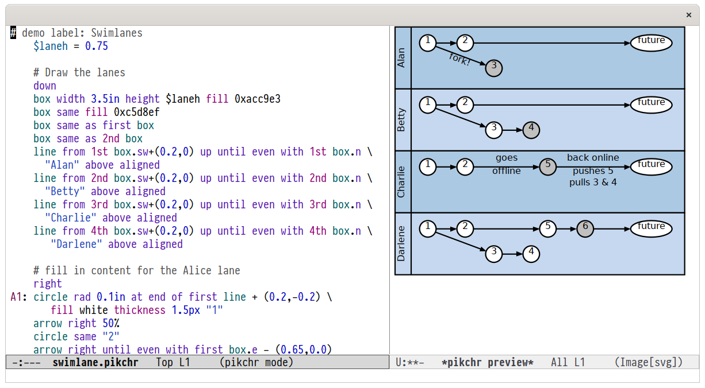

# pikchr-mode

A major mode for the [pikchr](https://pikchr.org/) diagram markup language.

## Features

- Syntax highlighting
- Interactive preview: `C-c C-c` will preview the current region or the current
  buffer; `C-u C-c C-c` will preview the current buffer up to and including the
  current line.

## Known Issues

Pikchr uses heuristics to place text.  The default font family and size chosen
by Emacs to render the interactive preview might be different from that used by
a browser and the alignment might be off (see screenshot above).
